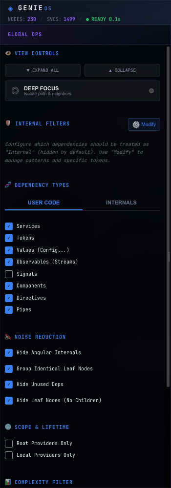

# ⚙️ Options Panel

The left-hand panel for global control over filtering and noise reduction. Changes apply reactively and affect every view that supports synchronization.

← [Docs home](../README.md) · [Feature overview](./README.md)

---

Large DI graphs are noisy. The Options Panel is where you cut that noise down — hiding framework internals, collapsing repetition, and narrowing scope — so the views show only what you care about.

<strong>Main option groups</strong>

- **View Controls** 🖱️
  - Expand All / Collapse All
  - Deep Focus (isolate a selected branch)
- **Dependency Types** 🏷️
  - toggle categories (User Code vs. Angular Internals)
- **Noise Reduction** 🎚️
  - hide Angular internal mechanisms,
  - group identical leaves,
  - hide unused providers,
  - hide leaf nodes (no children)
- **Scope & Lifetime** ⭕
  - Root only / Local only
- **Complexity Filter** 📏
  - a slider for minimum subtree complexity
- **Deep Search** 🔎
  - search and tagging by components or providers,
  - matching mode (AND / OR),
  - dynamic view rebuilding for the selected elements

---

## Related

- [Views](./views.md) — what these options reshape.
- [Inspector Panel](./inspector-panel.md) — its local filters can sync with this panel.
